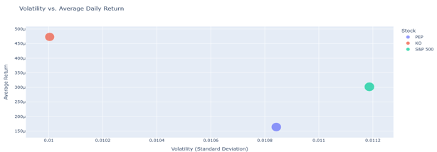

# STOCK-MARKET_TREND_ANALYSIS
Welcome to the Stock Market Analysis and Prediction repository! This project provides data-driven insights into stock market performance using advanced Machine Learning (ML) and Deep Learning (DL) models.

## Table of Contents
- [Project Overview](#project-overview)
- [Project Objective](#project-objective)
- [Data Sources](#data-sources)
- [Data Preprocessing & Feature Engineering](#data-preprocessing-&-feature-ngineering)
- [Technical Indicators](#technical-Indicators)
- [Predictive Modeling](#predictive-modeling)
- [Fundamental Analysis](#fundamental-analysis)
- [Evaluation Metrics](#evaluation-metrics)
- [Strategic Insights & Recommendations](#strategic-insights-&-eecommendations)
- [Conclusion](#conclusion)

## Project Overview
This repository contains an end-to-end data-driven stock prediction project for Prime INC. We compare two blue-chip companies—PepsiCo (PEP) and Coca-Cola (KO)—against the S&P 500 benchmark. Through exploratory data analysis, technical feature engineering, machine learning (XGBoost & LSTM) forecasting, and fundamental financial assessment, we derive actionable investment strategies.

## Project Objective
- Identify which stock offers the best balance of risk and return.
- Predict next-day price movement (up/down) using state-of-the-art models.
- Integrate fundamental metrics to validate and enrich technical signals.
- Recommend a blended strategy for portfolio expansion.

## 📂 Data Sources  
- Price & Volume Data:
    - Downloaded via yfinance for tickers PEP, KO, and S&P 500 (^GSPC).
- Fundamentals:
    - Company info, valuation, profitability, leverage, growth metrics pulled from yfinance.info.

## Data Preprocessing & Feature Engineering
1. Adj Close & Returns
   - Calculated daily returns and shifted “tomorrow” close price.
2. Direction Label
   - Binary target: 1 if next-day price ↑, 0 if ↓.
3. Technical Indicators
   - SMA_10, SMA_50, EMA_10, EMA_50
   - Rolling volatility (Std Dev), Bollinger Bands
   - RSI (Relative Strength Index)
   - MACD & Signal Line
   - Handling Missing Values
4.Handling Missing Values
   - Dropped initial NaNs from rolling calculations and shifts.

## Technical Indicators

| Indicator          | What It Shows                                        | How It’s Used                                    |
|--------------------|------------------------------------------------------|--------------------------------------------------|
| **SMA_20**         | 20-day simple moving average of closing prices       | Identifies overall trend direction               |
| **EMA_20**         | 20-day exponential moving average (more recent-weighted) | Captures short-term momentum shifts          |
| **RSI**            | Relative Strength Index (0–100 oscillator)           | Flags overbought (>70) or oversold (<30) levels  |
| **MACD**           | Difference between 12-day and 26-day EMAs            | Generates buy/sell signals via histogram crossovers |
| **Bollinger Bands**| Upper/lower bands at ±2σ around the 20-day SMA       | Highlights periods of unusually high/low volatility |

## Predictive Modeling
- Train/Test Split: 80% train, 20% test (time-series split, no shuffle)
- XGBoost Classifier
  - Features: technical indicators + daily return
  - Hyperparameter tuning via grid/random search
- LSTM Neural Network
  - Reshaped scaled features into [samples, timesteps, 1]
  - Two stacked LSTM layers + dropout for regularization
  - Hyperparameter tuning via Keras Tuner

## Fundamental Analysis
- Valuation: P/E, forward P/E, price-to-book
- Profitability: gross/operating/profit margins, ROE
- Leverage & Liquidity: debt/equity, current ratio
- Growth: revenue & EPS growth, dividend yield
- Comparison:
  - KO: stronger margins, revenue growth, lower debt
  - PEP: better valuation, higher dividend yield, EPS momentum

## Evaluation Metrics
- Classification: accuracy, precision, recall, F1-score, confusion matrix
- Risk-Adjusted: Sharpe ratio comparison vs. S&P 500
- Model Comparison: XGBoost vs. LSTM performance on test set

## Strategic Insights & Recommendations
- Core Holding: Coca-Cola (KO) for stability, market alignment, and strong fundamentals.
- Tactical Allocation: PepsiCo (PEP) when valuations dip below historical averages—capture income and value.
- Blended Strategy:
  1. KO as the portfolio anchor (safety + growth)
  2. PEP as a tactical opportunistic play (value + income)
- Rebalance Cadence: Quarterly retraining of models and fundamental review.

## Conclusion
This project demonstrates how integrating technical analysis, predictive modeling, and fundamental insights can guide robust investment decisions. The blended KO/PEP strategy, underpinned by XGBoost and LSTM forecasts, offers Prime INC a balanced path to capture both stability and upside in its 2025 portfolio expansion.

📌 The full notebook and codebase are available in this repository. Contributions and feedback are welcome!

